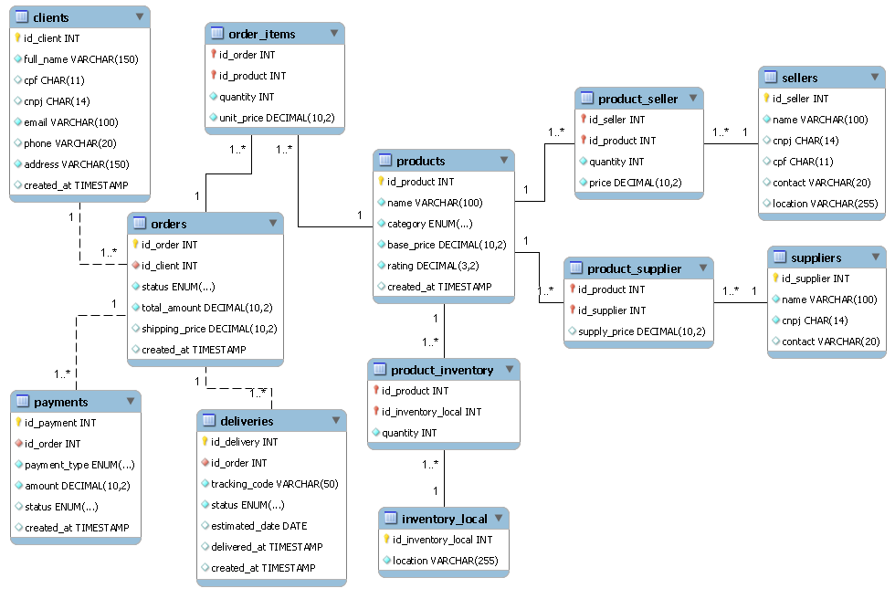

# 🛒 E-Commerce — Projeto de Modelagem Lógica e Implementação de Banco de Dados

Projeto desenvolvido como parte do desafio da [DIO](https://www.dio.me/) no módulo de Modelagem de Banco de Dados. O objetivo foi modelar e implementar um banco de dados relacional para um cenário de e-commerce, aplicando conceitos de modelagem conceitual, lógica e física, além de consultas SQL complexas.

---

## 📋 Descrição do Projeto

O banco de dados `e_commerce` representa o esquema lógico de um sistema de comércio eletrônico, implementado em MySQL 8+. 

Além disso, o modelo inclui validações de integridade utilizando `CHECK`, `UNIQUE` e chaves estrangeiras, garantindo consistência dos dados conforme boas práticas de modelagem relacional.

O projeto aplica os seguintes refinamentos propostos no módulo de modelagem conceitual: 
- **Cliente PJ e PF** — Uma conta pode ser PJ ou PF, mas nunca as duas ao mesmo tempo, controlado via `CHECK` constraint (compatível com MySQL 8+)
- **Pagamento** — Um pedido pode ter mais de uma forma de pagamento cadastrada
- **Entrega** — Possui status e código de rastreio próprios, modelados em tabela separada

---

## 🗂️ Diagrama EER



---

## 🏗️ Estrutura do Banco de Dados

O banco é composto por 12 tabelas:

| Tabela | Descrição |
|---|---|
| `clients` | Clientes PF (CPF) e PJ (CNPJ) |
| `products` | Produtos com categoria, preço base e avaliação |
| `orders` | Pedidos realizados pelos clientes |
| `order_items` | Itens de cada pedido com quantidade e preço unitário |
| `payments` | Pagamentos — múltiplas formas por pedido |
| `deliveries` | Entregas com status e código de rastreio |
| `inventory_local` | Locais físicos de armazenamento |
| `product_inventory` | Estoque de produtos por local |
| `sellers` | Vendedores PF e PJ |
| `product_seller` | Relação entre vendedores e produtos |
| `suppliers` | Fornecedores |
| `product_supplier` | Relação entre fornecedores e produtos com preço de fornecimento |

---

## 🔗 Relacionamentos

- Um **cliente** pode ter vários **pedidos**
- Um **pedido** pode ter vários **itens**, cada item referenciando um **produto**
- Um **pedido** pode ter vários **pagamentos** (diferentes formas)
- Um **pedido** possui uma **entrega** com código de rastreio e status
- Um **produto** pode estar em vários **estoques** (por local)
- Um **produto** pode ser vendido por vários **vendedores**
- Um **produto** pode ser fornecido por vários **fornecedores**

---

## ⚙️ Como executar

### Pré-requisitos

- MySQL 8.0 ou superior
- MySQL Workbench (opcional)

### Passos

```bash
# 1. Clone o repositório
git clone https://github.com/davicesar2026/dio-database-project-ecommerce.git

# 2. Acesse o MySQL
mysql -u root -p

# 3. Execute o script principal
source ./sql/ecommerce-database.sql
```

Ou importe diretamente pelo MySQL Workbench em **File > Run SQL Script**.

---

## 🔍 Queries implementadas

As consultas foram elaboradas para responder perguntas de negócio concretas, cobrindo todas as cláusulas exigidas pelo desafio:

| # | Pergunta | Cláusulas |
|---|---|---|
| 1 | Quantos pedidos foram feitos por cada cliente? | `SELECT`, `LEFT JOIN`, `GROUP BY`, `ORDER BY` |
| 2 | Qual o valor total gasto por cliente em pedidos confirmados ou entregues? | `WHERE`, `GROUP BY`, `ORDER BY`, atributo derivado |
| 3 | Algum vendedor também é fornecedor? | `JOIN`, comparação de atributos | 
| 4 | Qual a margem de lucro por produto e fornecedor? | `JOIN`, atributo derivado, `ORDER BY` |
| 5 | Qual a relação de produtos em estoque por local? | `JOIN`, `ORDER BY` |
| 6 | Quais produtos têm estoque abaixo de 20 unidades? | `WHERE`, `JOIN`, `ORDER BY` |
| 7 | Qual a receita total por categoria de produto? | `GROUP BY`, `HAVING`, `ORDER BY` |
| 8 | Qual o status de entrega e rastreio de cada pedido? | `JOIN`, `ORDER BY` |
| 9 | Quais pedidos têm pagamento aprovado mas entrega pendente? | `WHERE`, `EXISTS`, `JOIN` |
| 10 | Quais vendedores têm maior estoque disponível? | `GROUP BY`, `HAVING`, `ORDER BY` |
| 11 | Quantos clientes são PF e quantos são PJ? | `CASE`, `GROUP BY` |
| 12 | Qual o ticket médio por forma de pagamento? | `WHERE`, `GROUP BY`, `ORDER BY`, atributo derivado |

---

## 📦 Dados de teste

O script inclui dados de teste para todas as tabelas:

- **16 clientes** — 11 Pessoas Físicas e 5 Pessoas Jurídicas
- **15 produtos** — nas categorias Hardware, Periferico e Smartphone 
- **18 pedidos** com diferentes status
- **21 itens de pedido**
- **19 pagamentos** — incluindo pedido com múltiplas formas de pagamento
- **18 entregas** com códigos de rastreio e status variados
- **10 locais de estoque**
- **12 vendedores** — PF e PJ
- **11 fornecedores**

---

## 🛠️ Tecnologias utilizadas


---

## 👨‍💻 Autor

Davi César Campos de Oliveira

[](https://github.com/davicesar2026)
[](https://www.linkedin.com/in/davicesar-ti)
